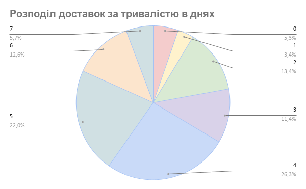
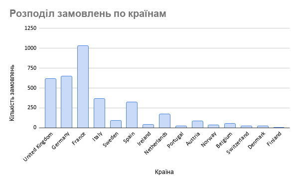
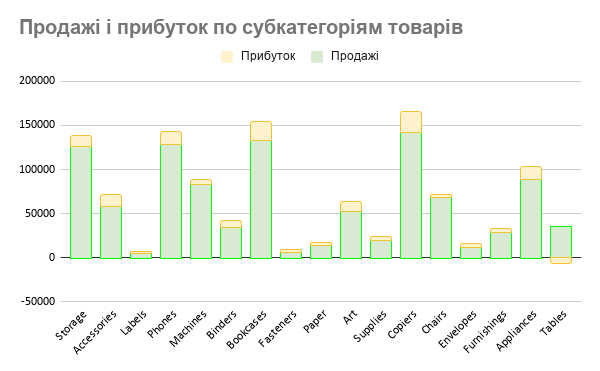

# Аналіз продажів та доставки

## Опис проєкту
Метою проєкту є аналіз продажів та ефективності доставки товарів для виявлення ключових трендів і можливостей оптимізації.

## Дані
Дані містять інформацію про замовлення, країни доставки, час доставки, продажі та прибуток.

🔗 Google Sheets: [(https://docs.google.com/spreadsheets/d/1pXeNHSc9PcqXV0s0vMW5rsnuN0pdkR0eB4fk_YN_OwU/edit?usp=sharing)]

## Виконаний аналіз
- Змінила відображення дат в таблиці
- Розраховано час доставки для кожного замовлення  
- Згруповано доставки за тривалістю (0–7 днів)  
- Проаналізовано кількість доставок по країнах  
- Проаналізовано продажі та прибуток по субкатегоріях
  
## Візуалізація

### Час доставки

### Розподіл по країнах

### Продажі та прибуток 

## Висновки
- Основна кількість доставок виконується протягом 2-6 днів.
- Найбільша кількість замовлень припадає на три ключові країни, що формують основний обсяг продажів.
- Розподіл продажів і прибутку по субкатегоріях нерівномірний: окремі категорії генерують більшу частину прибутку.
- Виявлено субкатегорії з високими продажами, але відносно низьким прибутком, що може свідчити про низьку маржинальність.

## Інструменти
- Google Sheets  
- SQL (в процесі)  
- Tableau (заплановано)  

## Статус
Проєкт у процесі розробки
